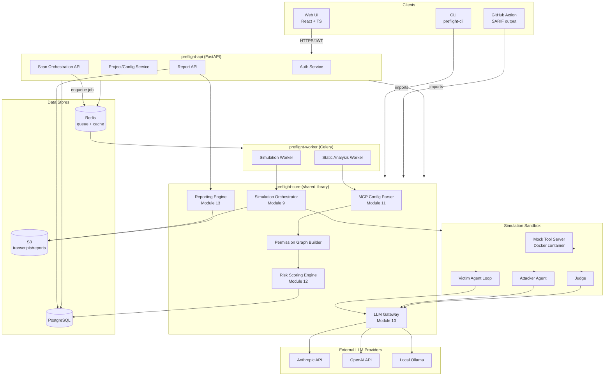
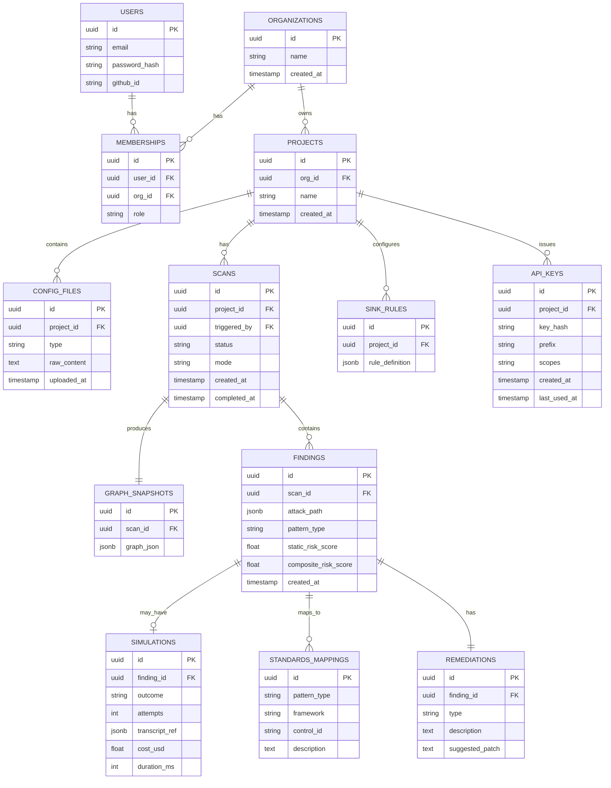
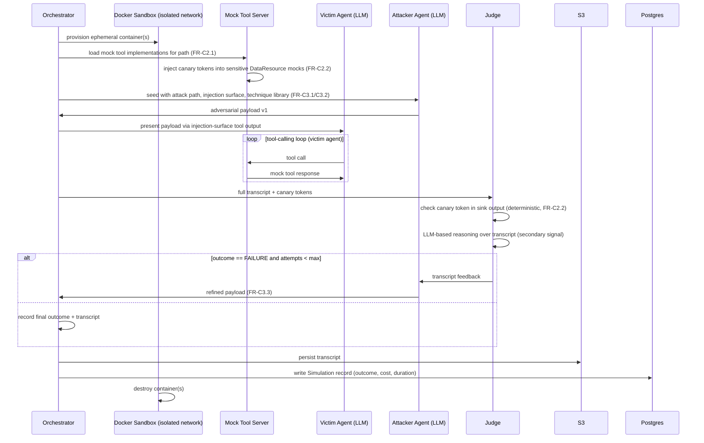
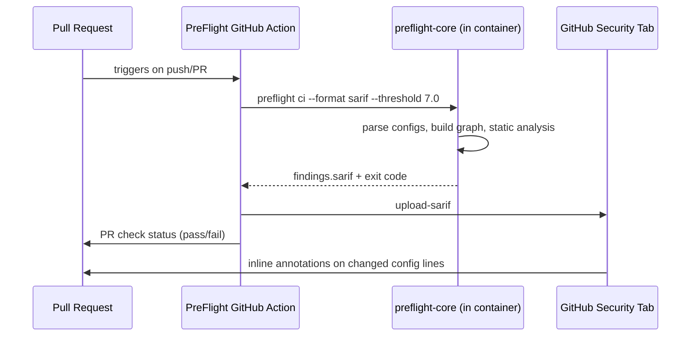
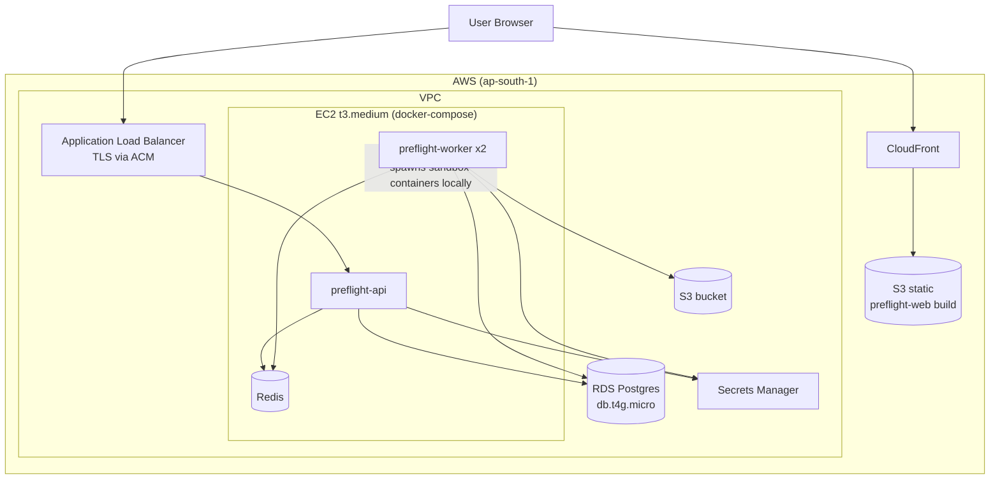
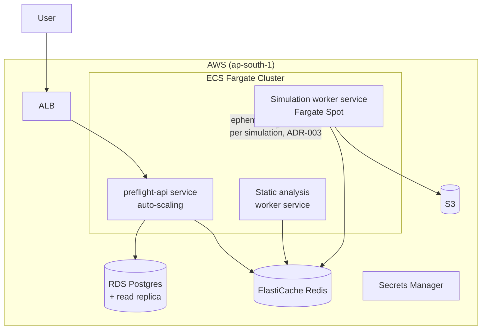

# 13_System_Architecture.md

# System Architecture Document

## Product

PreFlight — MCP & Agent Permission Attack-Surface Scanner

## Document Status

Derived from `11_Final_Startup_Selection.md` (final decision) and `12_Product_Requirements_Document.md` (functional/non-functional requirements). This document resolves the open architecture questions in PRD Section 14 and provides implementation-ready architecture guidance.

## Audience

Engineering team (3 engineers), for sprint/implementation planning.

## Architectural Philosophy

Three constraints dominate every decision in this document, in priority order:

1. **3-person team, 15-month timeline** — favor proven, boring, low-operational-overhead technology over novel infrastructure. Every piece of bespoke infrastructure is a maintenance tax this team cannot afford.
2. **Core engine must be a standalone library** (NFR-8) — the permission-graph builder, risk scoring engine, and simulation engine must work identically whether invoked from the CLI (`preflight scan`), a CI job, or the hosted API. This is both an engineering discipline (one codebase, two front-doors) and the foundation of the open-core adoption strategy from `11_Final_Startup_Selection.md` Section 11.
3. **Safety-by-construction for the simulation engine** — Section 18 of the PRD is non-negotiable. The simulation engine's sandbox boundary is a security control for *PreFlight's own product*, not just a feature.

---

# 1. High-Level Architecture

## 1.1 Architectural Style

**Modular monolith with a separable core library, plus an async worker pool.**

This is a deliberate rejection of microservices for the MVP. A 3-person team running microservices spends a disproportionate fraction of its 15 months on service-to-service auth, deployment orchestration, and distributed debugging — none of which advance G1–G5 in the PRD. Instead:

* `preflight-core` — a pure-Python library containing the permission graph builder (Module A/11), risk scoring engine (Module B/12), simulation engine (Module C/9), and reporting engine (Module D/13). No web framework dependencies. Installable standalone via `pip install preflight-core`.
* `preflight-api` — a FastAPI application that imports `preflight-core` and exposes it over HTTP, adding persistence, auth, and multi-user concerns.
* `preflight-cli` — a Typer-based CLI that imports `preflight-core` directly (no HTTP round-trip required for local/CI use).
* `preflight-web` — the React frontend, talking only to `preflight-api`.
* `preflight-worker` — Celery workers that import `preflight-core` to execute long-running scan/simulation jobs dispatched by `preflight-api`.

This means **the exact same risk-scoring and simulation code runs in a developer's CI pipeline and in the hosted SaaS** — critical for trust ("the open-source scanner and the SaaS agree because they're the same engine") and for the research validation goals (A3, G4).

## 1.2 Layered View

```
┌─────────────────────────────────────────────────────────────────┐
│  Clients                                                          │
│  ┌────────────────┐  ┌────────────────┐  ┌────────────────────┐ │
│  │  Web UI (React) │  │  CLI (preflight)│  │ CI (GitHub Action) │ │
│  └────────┬────────┘  └────────┬────────┘  └─────────┬──────────┘ │
└───────────┼────────────────────┼─────────────────────┼───────────┘
            │ HTTPS/REST          │ direct import        │ direct import
            ▼                     ▼                      ▼
┌─────────────────────────────────────────────────────────────────┐
│  preflight-api (FastAPI)              preflight-core (library)   │
│  - Auth/AuthZ                          - parsers/                 │
│  - Project/Scan CRUD                   - graph/                  │
│  - Job dispatch                        - risk/                   │
│  - Report retrieval                    - simulation/              │
│                                         - llm/                    │
│                                         - reporting/              │
└───────────┬────────────────────────────────┬──────────────────────┘
            │                                 │ imported by both
            ▼                                 ▼
┌──────────────────────┐          ┌─────────────────────────────────┐
│  preflight-worker      │          │  preflight-cli                 │
│  (Celery, imports     │          │  (Typer, imports                │
│   preflight-core)      │          │   preflight-core)               │
└──────┬─────────┬──────┘          └─────────────────────────────────┘
       │         │
       ▼         ▼
┌───────────┐ ┌────────────────────┐
│  Postgres │ │ Sandbox (Docker)   │
│  Redis    │ │ + LLM Gateway      │
│  S3       │ │ (Anthropic/OpenAI/ │
└───────────┘ │  Ollama)           │
              └────────────────────┘
```

---

# 2. Component Diagram



---

# 3. Frontend Architecture

| | |
|---|---|
| **Purpose** | Provide the web dashboard for UC-3, UC-4, UC-5, UC-7 (graph visualization, finding drill-down, simulation transcript review, report export, sink-rule configuration). |
| **Inputs** | REST/JSON from `preflight-api`; user interactions. |
| **Outputs** | Rendered UI; API calls (scan triggers, config uploads, sink-rule edits, report export requests). |
| **Technologies** | React 18 + TypeScript + Vite; Tailwind CSS + shadcn/ui component library; TanStack Query (server state/caching); Zustand (local UI state); Cytoscape.js + cytoscape-dagre (permission graph visualization — chosen over react-flow for better performance on graphs up to ~1,000 nodes per NFR-1 and built-in graph layout algorithms); React Router. |
| **Security considerations** | JWT access token held in memory only (not localStorage, to mitigate XSS token theft); refresh token in httpOnly+Secure+SameSite=Strict cookie; all API calls over HTTPS; CSP headers served via CloudFront; uploaded config files validated client-side (size/type) before submission but **never trusted** — server re-validates (FR-A1.4). |

## 3.1 Page/Route Map

| Route | Purpose |
|---|---|
| `/login`, `/signup` | Auth (email/password + GitHub OAuth) |
| `/projects` | Project list, create new project |
| `/projects/:id` | Project overview — config files, scan history |
| `/projects/:id/scans/:scanId` | Scan results: graph view (Cytoscape) + findings table (FR-D1.1, FR-D1.3) |
| `/projects/:id/scans/:scanId/findings/:findingId` | Finding detail: attack path, static score breakdown, simulation transcript viewer, standards mapping, remediation (FR-D1.2) |
| `/projects/:id/settings/sinks` | Custom sensitive-sink rule configuration (UC-7, FR-B1.2) |
| `/projects/:id/settings/api-keys` | CLI/CI API key management |
| `/projects/:id/reports` | Report export (PDF/JSON/research export) (FR-D4.1/D4.2) |

## 3.2 Key Frontend Components

* `PermissionGraphView` — Cytoscape canvas, color-codes nodes/edges by Composite Risk Score, click-to-highlight attack paths.
* `FindingCard` / `FindingsTable` — sortable/filterable list (FR-D1.3).
* `SimulationTranscriptViewer` — turn-by-turn transcript renderer (attacker/victim/judge), canary-token match highlighting.
* `ScanProgressTracker` — polls scan job status via TanStack Query (job queue per FR-F4).
* `RemediationDiffViewer` — renders suggested config patch (FR-D2.2) as a unified diff.

---

# 4. Backend Architecture

| | |
|---|---|
| **Purpose** | Multi-user persistence, auth, job orchestration, and report retrieval layer around `preflight-core`. |
| **Inputs** | HTTPS requests from web UI; Celery task results from workers. |
| **Outputs** | JSON responses; enqueued Celery jobs; persisted DB records. |
| **Technologies** | FastAPI (Python 3.12); Pydantic v2 for schemas; SQLAlchemy 2.0 + Alembic for ORM/migrations; Celery + Redis for async jobs; Uvicorn/Gunicorn for serving. |
| **Security considerations** | All endpoints behind auth middleware except `/health` and `/auth/*`; request size limits on config uploads (NFR-6); SQL injection prevented via ORM parameterization; rate limiting per API key (Section 5). |

## 4.1 Directory Structure

```
preflight/
├── core/                     # preflight-core (standalone, no FastAPI deps)
│   ├── parsers/              # Module 11
│   ├── graph/                # Module 11 (permission graph model)
│   ├── risk/                 # Module 12
│   ├── simulation/           # Module 9
│   │   ├── orchestrator.py
│   │   ├── sandbox.py
│   │   ├── mock_tools/
│   │   └── canary.py
│   ├── llm/                  # Module 10
│   │   ├── gateway.py
│   │   ├── providers/
│   │   └── prompts/
│   └── reporting/            # Module 13
│       ├── standards_map.yaml
│       └── templates/
├── api/                       # preflight-api
│   ├── main.py
│   ├── routers/
│   ├── deps.py                # auth/db dependencies
│   └── schemas/
├── worker/                    # preflight-worker
│   └── tasks.py
├── cli/                        # preflight-cli
│   └── main.py
├── models/                     # SQLAlchemy models
├── migrations/                 # Alembic
└── config/
    ├── scoring_config.yaml
    └── model_routing.yaml
```

## 4.2 Why a Modular Monolith (Restated)

Each `core/` subpackage has a narrow, well-defined interface (e.g., `graph.build(configs: list[ConfigFile]) -> PermissionGraph`). This means that if, post-15-months, the team needs to extract the simulation engine into its own scalable service (Phase 3), the interface boundary already exists — extraction becomes a deployment change, not a redesign.

---

# 5. API Layer

| | |
|---|---|
| **Purpose** | Expose `preflight-core` functionality and persisted data to the web UI and (Phase 2) third-party integrations. |
| **Inputs** | HTTPS requests (JSON bodies, query params, file uploads). |
| **Outputs** | JSON responses (Pydantic-serialized); OpenAPI 3.1 spec auto-generated by FastAPI. |
| **Technologies** | FastAPI routers, versioned under `/api/v1/`; `slowapi` for rate limiting (Redis-backed token bucket). |
| **Security considerations** | All write endpoints require auth; rate limits per API key/user to bound LLM cost exposure (NFR-3); errors follow RFC 7807 `application/problem+json` to avoid leaking stack traces. |

## 5.1 Core Endpoints

| Method | Path | Purpose | Auth |
|---|---|---|---|
| POST | `/api/v1/auth/login` | Email/password or OAuth login | Public |
| POST | `/api/v1/auth/refresh` | Refresh access token | Refresh cookie |
| GET | `/api/v1/projects` | List projects | User |
| POST | `/api/v1/projects` | Create project | User |
| POST | `/api/v1/projects/{id}/configs` | Upload MCP/agent config file(s) (FR-A1) | User, role ≥ Editor |
| POST | `/api/v1/projects/{id}/scans` | Trigger scan (static-only or full, FR-E1/E2) | User, role ≥ Editor |
| GET | `/api/v1/projects/{id}/scans/{scanId}` | Scan status + summary | User |
| GET | `/api/v1/projects/{id}/scans/{scanId}/graph` | Graph snapshot (for Cytoscape) | User |
| GET | `/api/v1/projects/{id}/scans/{scanId}/findings` | Paginated findings list (FR-D1.3) | User |
| GET | `/api/v1/findings/{id}` | Finding detail incl. simulation transcript | User |
| POST | `/api/v1/findings/{id}/simulate` | Trigger/re-trigger dynamic simulation for one finding | User, role ≥ Editor |
| GET/PUT | `/api/v1/projects/{id}/sink-rules` | Custom sink rule config (UC-7) | User, role ≥ Editor |
| GET | `/api/v1/projects/{id}/scans/{scanId}/report` | Generate/retrieve report (PDF/JSON/SARIF) (FR-D4) | User |
| POST/GET/DELETE | `/api/v1/projects/{id}/api-keys` | CI/CLI API key management | User, role = Owner |

## 5.2 Pagination & Error Format

* List endpoints use cursor-based pagination (`?cursor=...&limit=50`) — required for findings lists which may exceed hundreds of entries for large graphs.
* Error responses: `{"type": "...", "title": "...", "status": 4xx, "detail": "...", "instance": "..."}` per RFC 7807.

---

# 6. Authentication & Authorization

| | |
|---|---|
| **Purpose** | Authenticate web users and CI/CLI clients; authorize project-level actions. |
| **Inputs** | Credentials (email/password, OAuth callback), API keys. |
| **Outputs** | JWT access/refresh tokens; authenticated request context (`user_id`, `org_id`, `role`). |
| **Technologies** | `fastapi-users` or custom JWT implementation with `python-jose`; Argon2 (via `passlib`) for password hashing; Authlib for GitHub OAuth. |
| **Security considerations** | Access tokens short-lived (15 min); refresh tokens rotated on use and revocable (stored hashed in DB); API keys hashed (SHA-256) at rest, shown only once on creation, prefixed (`pf_live_...` / `pf_test_...`) for scanning-tool detection (so leaked keys can be auto-detected by GitHub secret scanning). |

## 6.1 Identity Model (Future-Proofed Now)

Although multi-tenant org management is explicitly a Phase 2 non-goal (PRD Section 3.4), the **database schema** includes `organizations` and `memberships` tables from day one with a default "personal org per user" — this avoids a painful schema migration later (this is an Architecture Decision, see ADR-006 in Section 20).

| Role | Permissions |
|---|---|
| Owner | Full control: API keys, billing (future), member management, all project actions |
| Editor | Upload configs, trigger scans/simulations, edit sink rules |
| Viewer | Read-only: view graphs, findings, reports |

## 6.2 GitHub OAuth Rationale

The primary persona (AI Platform Engineer, Section 4.1 of PRD) and the CI integration (Module E) both live in GitHub. GitHub OAuth as a first-class login option reduces signup friction for the exact adoption flywheel target audience and naturally pairs with the GitHub Action (Section 14).

---

# 7. Database Design

| | |
|---|---|
| **Purpose** | Durable storage for projects, configs, scans, findings, simulations, and access control. |
| **Inputs** | Writes from `preflight-api` and `preflight-worker`. |
| **Outputs** | Query results for API responses and reporting. |
| **Technologies** | PostgreSQL 15+ (AWS RDS); SQLAlchemy 2.0 ORM; Alembic migrations; `JSONB` for semi-structured graph/transcript data. |
| **Security considerations** | Encryption at rest (RDS-managed KMS key); connection over TLS; least-privilege DB user for app vs. migrations; row-level access enforced in application layer via project membership checks (Postgres RLS considered but deferred — see ADR-009). |

## 7.1 Entity-Relationship Diagram



## 7.2 Indexing Strategy

* `findings(scan_id, composite_risk_score DESC)` — for sorted findings lists (FR-D1.3).
* `scans(project_id, created_at DESC)` — scan history.
* GIN index on `graph_snapshots.graph_json` if node/edge attribute querying is needed for drift detection (Phase 2, FR-D1.4).
* `api_keys(key_hash)` unique index — fast key lookup on every CI request.
* `standards_mappings(pattern_type)` — small reference table, likely fully cached in memory by the application (Section 18 NFR-10).

## 7.3 Transcript & Large-Object Storage

`simulations.transcript_ref` stores an **S3 object key**, not the transcript itself — full transcripts (FR-C4.3) can be large (many LLM turns) and are better suited to S3 with Postgres holding only the pointer + summary fields (`outcome`, `cost_usd`, etc.) for fast querying.

---

# 8. Graph Storage Design

| | |
|---|---|
| **Purpose** | Represent, persist, and query the permission graph (Module A/11 of PRD) for static analysis, visualization, and (Phase 2) drift comparison. |
| **Inputs** | Parsed config files → graph construction calls from `preflight-core/graph`. |
| **Outputs** | `PermissionGraph` objects (in-memory, NetworkX) for computation; serialized JSON (node-link format) for persistence and frontend rendering. |
| **Technologies** | NetworkX (`DiGraph`) for in-process graph algorithms; JSON node-link serialization stored in `graph_snapshots.graph_json` (Postgres JSONB). |
| **Security considerations** | Graph data may encode sensitive infrastructure topology (tool names, internal data resource names) — access-controlled identically to project data; never included in anonymized research exports without scrubbing (FR-D4.2). |

## 8.1 Decision: NetworkX + JSONB over a Graph Database (ADR-001)

For the MVP scale defined in NFR-1 (graphs up to ~1,000 nodes / ~5,000 edges, per-project), a dedicated graph database (Neo4j, Amazon Neptune) is **not justified**:

* NetworkX path-finding (Yen's algorithm / k-shortest-paths, Dijkstra) handles this scale in milliseconds to low seconds (NFR-1).
* JSONB in Postgres avoids operating a second database system — a meaningful operational-overhead saving for 3 engineers.
* The frontend's Cytoscape.js consumes the same node-link JSON directly — no transformation layer needed.

**Revisit trigger (documented for Phase 3):** if/when PreFlight needs *cross-project* graph queries (e.g., "show me every agent across the org that can reach this specific credential" — an MSSP/enterprise feature from Section 15.3 of the PRD), a graph database becomes justified. The `PermissionGraph` abstraction in `core/graph/` is designed so its backing store can be swapped without changing callers (repository pattern).

## 8.2 Graph Snapshot Versioning

Each scan produces an **immutable** `GraphSnapshot`. Phase 2 drift detection (UC-9, FR-D1.4) is implemented as a diff between two snapshots' node-link JSON (added/removed nodes and edges), not as a mutable graph — this keeps the data model simple and auditable (every historical scan remains exactly reproducible).

---

# 9. Attack Simulation Engine

This is PreFlight's core technical differentiator (per `11_Final_Startup_Selection.md` Section 8) and the component requiring the most architectural care.

| | |
|---|---|
| **Purpose** | For each candidate attack path (Module B output), run a sandboxed Attacker/Victim/Judge simulation to empirically validate exploitability (FR-C1–C5). |
| **Inputs** | `AttackPath` (subgraph: agent, tools, data resources, sink), `GraphSnapshot` context, project sink-rule config, model routing config. |
| **Outputs** | `Simulation` result: outcome (`SUCCESS`/`PARTIAL`/`FAILURE`), full transcript (S3), cost/duration metrics, canary-token match evidence. |
| **Technologies** | Celery task (`SIMWORKER`); Docker SDK for Python (sandbox lifecycle); FastAPI-based Mock Tool Server (runs inside sandbox container); LLM Gateway (Section 10). |
| **Security considerations** | Section 18 of PRD — sandboxed by default, no production access, ephemeral containers, no automatic external transmission of generated payloads. |

## 9.1 Simulation Sequence



## 9.2 Sandbox Architecture

* **Isolation unit:** one ephemeral Docker container per simulation run, on an isolated `docker network` with **no internet egress** by default.
* **Mock Tool Server:** a small FastAPI app (`core/simulation/mock_tools/`) implementing mock implementations for the tool categories in FR-C2.1 (filesystem, email/messaging, HTTP/web-fetch, database/CRM, calendar). Each mock tool returns synthetic, canary-tagged data (FR-C2.2).
* **Victim Agent Loop:** runs as a process inside the sandbox container, executing the standard tool-calling loop against the Mock Tool Server (not against any real backend), using the model specified for the project under test.
* **Resource limits:** per-container CPU/memory caps and a hard wall-clock timeout (aligned with NFR-2, ~2 minutes) enforced via Docker `--cpus`, `--memory`, and orchestrator-side `asyncio` timeout + `docker kill` fallback.
* **Hardening checklist** (enforced via Docker run config, Section 15 expands this):
  * `--read-only` root filesystem with a tmpfs scratch mount.
  * Non-root user (`USER 1000` in Dockerfile).
  * `--security-opt=no-new-privileges`, seccomp default profile.
  * `--network=none` by default; only the opt-in real-tool-substitution mode (FR-C2.3) attaches a network, and only to an explicitly user-approved disposable endpoint, with an egress allowlist.
  * `--cap-drop=ALL`.

## 9.3 Why Docker (Not Firecracker/gVisor) for MVP (ADR-003 preview)

Docker containers provide sufficient isolation for the MVP threat model (running LLM-generated tool calls against *mock* tools with no real credentials, no real network access). Firecracker/gVisor-grade isolation becomes important when (a) the SaaS is multi-tenant and untrusted users' configs run on shared infrastructure, and (b) opt-in real-tool substitution (FR-C2.3) sees adoption. This is documented as a **Phase 2/3 hardening item**, not blocking the MVP (full ADR in Section 20).

---

# 10. LLM Integration Layer

| | |
|---|---|
| **Purpose** | Provide a single, provider-agnostic interface for all LLM calls (Tool Classifier, Attacker, Victim, Judge) with cost tracking, caching, and retries (FR-A3, Module C, NFR-3, NFR-9). |
| **Inputs** | Role identifier (`classifier`/`attacker`/`victim`/`judge`), prompt template + variables, project-level model routing config. |
| **Outputs** | Model response (text/tool-calls); structured cost/latency metadata logged for every call. |
| **Technologies** | LiteLLM (provider abstraction over Anthropic, OpenAI, and local Ollama); Jinja2 (prompt templates); Redis (classifier result cache); `tenacity` (retry/backoff). |
| **Security considerations** | API keys stored in AWS Secrets Manager, injected as environment variables to workers only (never exposed to frontend); all prompts/responses logged with PII/secret redaction (NFR-9); per-project/org rate and cost limits enforced before dispatching calls. |

## 10.1 Why LiteLLM (ADR-002)

LiteLLM provides a unified `completion()` interface across Anthropic, OpenAI, and Ollama with minimal glue code, and natively supports cost calculation per call — directly serving NFR-3/NFR-9 with far less custom code than a bespoke adapter layer. PreFlight wraps LiteLLM in a thin `LLMGateway` class to add: project-scoped cost accounting, the classifier cache, and prompt-template management.

## 10.2 Model Routing Configuration

`config/model_routing.yaml` (per-project override-able):

```yaml
classifier:
  provider: ollama
  model: llama3.1:8b
  cache: true

attacker:
  provider: anthropic
  model: claude-sonnet-4-6
  max_attempts: 3

victim:
  provider: <matches the agent's real deployment model, user-configurable>
  model: <user-specified, default: claude-sonnet-4-6>

judge:
  provider: anthropic
  model: claude-sonnet-4-6
  rule_based_first: true   # canary-token check before LLM judge call
```

## 10.3 Cost Tracking Flow

Every `LLMGateway.call()` records `{role, provider, model, input_tokens, output_tokens, cost_usd, latency_ms}` to a `llm_call_logs` table (append-only). The Simulation Orchestrator (Section 9) sums these per `Simulation.cost_usd`; the Scan API aggregates per-scan totals and enforces the NFR-3 budget cap (configurable; default scan aborts remaining simulations if the cap is hit, surfacing partial results rather than failing the whole scan).

## 10.4 Prompt Template Management

Prompts for each role live as versioned Jinja2 templates under `core/llm/prompts/{role}/v{n}.jinja`. Versioning matters because prompt changes affect simulation outcomes — every `Simulation` record stores the prompt template version used, supporting the research reproducibility goal (A3 / Section 12 of `11_Final_Startup_Selection.md`).

---

# 11. MCP Configuration Analysis Engine

| | |
|---|---|
| **Purpose** | Parse MCP server manifests and agent configs into a validated, normalized `PermissionGraph` (Module A/11 of PRD). |
| **Inputs** | Raw config files (MCP server manifest JSON, agent config JSON/YAML, or PreFlight-native YAML) (FR-A1.1–A1.3). |
| **Outputs** | `PermissionGraph` (NetworkX `DiGraph`) with typed nodes (`Agent`, `MCPServer`, `Tool`, `DataResource`, `Credential`, `ExternalSink`) and edges per FR-A2.1/A2.2. |
| **Technologies** | Pydantic v2 models per supported config format (strict schema validation, FR-A1.4); `core/parsers/` plugin registry (one parser module per format, extensible per NFR-10); LLM Tool Classifier (via LLM Gateway) for ambiguous tools (FR-A3). |
| **Security considerations** | Config files may contain secrets/connection strings — these are extracted into `Credential` nodes as **references only** (e.g., env var names), never stored verbatim; uploaded files size-capped and scanned for type before parsing (NFR-6). |

## 11.1 Parser Plugin Interface

```python
class ConfigParser(Protocol):
    format_id: str  # e.g. "mcp_server_manifest_v1", "claude_desktop_mcp_json"
    def can_parse(self, raw: dict) -> bool: ...
    def parse(self, raw: dict) -> ParsedConfig: ...
```

New formats (Phase 2: LangChain tool defs, CrewAI configs) are added by implementing this interface and registering in `core/parsers/registry.py` — no changes to the graph builder required.

## 11.2 Graph Construction Pipeline

```
ConfigFile(s) → Parser.parse() → ParsedConfig
              → GraphBuilder.add_servers_and_tools()
              → ToolClassifier.classify(ambiguous_tools)  [cached, FR-A3.3]
              → GraphBuilder.add_data_resources_and_sinks()
              → GraphBuilder.add_credentials()
              → PermissionGraph (validated, serializable per FR-A2.5)
```

## 11.3 Tool Classifier Cache

Keyed by `hash(mcp_server_id + tool_name + tool_description + tool_schema)`. On cache hit, no LLM call is made (NFR-3 cost control). Cache stored in Postgres (`tool_classification_cache` table) with a Redis read-through layer for hot entries, seeded at launch from a curated classification set for popular open-source MCP servers (FR-A3.3, Dataset Strategy Section 11 of PRD).

---

# 12. Risk Scoring Engine

| | |
|---|---|
| **Purpose** | Compute Static Risk Scores for attack paths, detect named risk patterns, and combine with simulation outcomes into Composite Risk Scores (Module B/12 of PRD). |
| **Inputs** | `PermissionGraph`, sink-rule configuration (default + project custom, FR-B1), `scoring_config.yaml`, (optionally) `Simulation` outcome. |
| **Outputs** | Ranked list of `Finding` objects: `attack_path`, `pattern_type`, `static_risk_score`, `composite_risk_score`. |
| **Technologies** | NetworkX path-finding (Yen's k-shortest-paths / Dijkstra, FR-B3.1); `core/risk/` pattern-detector plugin registry; YAML-driven scoring weights (NFR-10). |
| **Security considerations** | Scoring config is data, not code — but is itself a security-sensitive artifact (mis-tuned weights could hide real risk); changes to `scoring_config.yaml` are versioned and require review (treated like a security policy change in CI for PreFlight's own repo). |

## 12.1 Static Risk Score Formula (initial, versioned)

```
static_risk_score(path) =
    base_weight(pattern_type)
  + Σ sensitivity_weight(node) for node in path.data_resources
  + Σ permission_weight(edge)  for edge in path.edges     # read=1, write=2, admin=3
  + trust_boundary_bonus  if path crosses untrusted-input → sink
  - depth_penalty * len(path)
```

All constants live in `config/scoring_config.yaml`, versioned alongside `Finding.scoring_config_version` for reproducibility.

## 12.2 Pattern Detector Registry (FR-B2.4)

```python
class PatternDetector(Protocol):
    pattern_id: str
    def detect(self, graph: PermissionGraph) -> list[AttackPath]: ...
```

MVP detectors: `LethalTrifectaDetector`, `ConfusedDeputyDetector`, `CredentialReuseDetector`, plus a `GenericPathDetector` (Yen's k-shortest-paths to any sink, FR-B2.1). Each returns `AttackPath` objects consumed by the scorer and (top-N, FR-B2.3) passed to the Simulation Engine.

## 12.3 Composite Risk Score (FR-C5.1)

```
composite_risk_score =
  if simulation.outcome == SUCCESS:  max(static_risk_score, SUCCESS_FLOOR)  # e.g. floor = 8.0/10
  elif simulation.outcome == PARTIAL: static_risk_score * PARTIAL_MULTIPLIER  # e.g. 1.1x, capped at 10
  elif simulation.outcome == FAILURE: static_risk_score * FAILURE_MULTIPLIER  # e.g. 0.85x — reduced, not zeroed
  else (not simulated): static_risk_score
```

Weights (`SUCCESS_FLOOR`, multipliers) are themselves the subject of the calibration research deliverable (PRD Section 12, Research Question 2) and are versioned in `scoring_config.yaml`.

---

# 13. Reporting Engine

| | |
|---|---|
| **Purpose** | Generate human-readable (PDF), machine-readable (JSON, SARIF), and research (anonymized) exports of scan results (Module D/13 of PRD). |
| **Inputs** | `Scan`, `GraphSnapshot`, `Finding[]`, `Simulation[]`, `RemediationRecommendation[]`, `StandardsMapping[]`. |
| **Outputs** | PDF report, JSON export, SARIF file (for GitHub code scanning, Section 14), anonymized research bundle. |
| **Technologies** | Jinja2 (HTML templating) + WeasyPrint (HTML→PDF, pure-Python, no headless-browser dependency); Pydantic `.model_dump_json()` for JSON export; `core/reporting/standards_map.yaml` for FR-D3. |
| **Security considerations** | PDF/JSON exports may contain customer-sensitive tool/data names — access-controlled identically to the underlying project; research export (FR-D4.2) runs through a dedicated scrubber (regex + allowlist) removing org-identifying strings, credentials, and free-text fields before bundling. |

## 13.1 Standards Mapping Data File (FR-D3.1/D3.2)

`core/reporting/standards_map.yaml` — versioned, structured, **not hardcoded**:

```yaml
lethal_trifecta:
  - framework: OWASP_AGENTIC
    control_id: "AGENTIC-T01"
    description: "Excessive Agency / Tool Combination Risk"
  - framework: AIUC1
    control_id: "E009"
    description: "Third-party / MCP access monitoring"
  - framework: MITRE_ATLAS
    control_id: "AML.T0051"
    description: "LLM Prompt Injection leading to Exfiltration"

confused_deputy:
  - framework: AIUC1
    control_id: "..."
    ...
```

Each `Finding.pattern_type` is looked up in this file at report-generation time — updating standards alignment as frameworks evolve (per `11_Final_Startup_Selection.md` Section 5.2) is a config change, not a code change.

## 13.2 Report Generation Flow

```
Finding[] + GraphSnapshot
  → ReportBuilder.assemble(scan)        # joins findings + simulations + standards_map + remediations
  → JSON export (FR-D4.1)               # always generated, cheap
  → SARIF export (Section 14)           # for CI
  → PDF: Jinja2 template → HTML → WeasyPrint → PDF (FR-D4.1)  # on-demand, async job
  → Research export: Scrubber → anonymized bundle (FR-D4.2)  # opt-in, async job
```

---

# 14. CI/CD Integration Architecture

| | |
|---|---|
| **Purpose** | Allow PreFlight to run inside a customer's CI pipeline and block/annotate PRs based on risk findings (UC-2, Module E of PRD). |
| **Inputs** | Repository config files (MCP manifests/agent configs in the repo), risk threshold configuration. |
| **Outputs** | Exit code (0/1, FR-E3); SARIF file (GitHub code scanning); human-readable terminal output (Rich); JSON output. |
| **Technologies** | `preflight-cli` (Typer) published to PyPI; Docker-based GitHub Action wrapping the CLI; `pip`/`pipx` installable for non-GitHub CI (GitLab CI, Jenkins). |
| **Security considerations** | CI runs are static-analysis-first by default (`--static-only`, FR-E2) — dynamic simulation in CI is opt-in (cost/time tradeoff, NFR-2/NFR-3); CLI never requires a PreFlight account for static-only mode (open-core, NFR-8) — full simulation requires an API key for LLM Gateway cost accounting. |

## 14.1 SARIF Output (Adoption Differentiator)

In addition to PreFlight's native JSON format, `preflight ci` emits a **SARIF 2.1.0** file. SARIF is the format GitHub's "Code Scanning" / Security tab natively consumes (used by CodeQL, Semgrep, etc.). Emitting SARIF means a `Finding` automatically appears as a GitHub Security alert with file/line annotations (mapped from `ConfigFile` source locations, FR-A2.3) — **zero custom UI needed** for a GitHub-native experience, directly serving G5 (adoption flywheel) with minimal engineering cost.

## 14.2 GitHub Action Flow



## 14.3 CLI Command Surface

```
preflight init                     # interactive config wizard (FR-A1.3)
preflight scan <path>              # full scan, human-readable output (FR-E1)
preflight scan <path> --static-only --format json
preflight ci --threshold 7.0 --format sarif   # CI mode (FR-E3)
preflight simulate <finding-id>    # re-run dynamic simulation (requires API key)
```

---

# 15. Security Architecture

PreFlight is a security product; its own security posture is part of the product's credibility. This section consolidates and extends Section 18 of the PRD.

| | |
|---|---|
| **Purpose** | Protect PreFlight's own infrastructure, customer configuration data, and prevent the simulation engine from becoming an attack vector. |
| **Inputs** | All external inputs: user uploads, API requests, LLM responses (treated as untrusted). |
| **Outputs** | Enforced access controls, encrypted data, audit trail. |
| **Technologies** | AWS Secrets Manager (credentials/API keys); AWS KMS (encryption keys); RDS encryption-at-rest; S3 SSE-KMS; TLS 1.2+ everywhere; Docker hardening (Section 9.2). |
| **Security considerations** | See threat model below. |

## 15.1 Threat Model Summary (STRIDE-lite)

| Threat | Relevant Component | Mitigation |
|---|---|---|
| Spoofing | API/Auth | JWT + OAuth, API key prefixes for leak-detection |
| Tampering | Config uploads, scoring config | Pydantic validation (FR-A1.4); scoring config version-controlled & reviewed |
| Repudiation | Scan triggers, API key usage | Append-only `audit_logs` table; `llm_call_logs` |
| Information Disclosure | Graph data, transcripts, research exports | Project-scoped access control; scrubber for research export (FR-D4.2); secrets stored as references not values (Section 11) |
| Denial of Service | LLM Gateway, simulation queue | Per-project rate limits (Section 5); cost cap (NFR-3) acts as a DoS-via-cost guard |
| Elevation of Privilege | **Simulation sandbox** — an LLM-driven "attacker" running arbitrary tool-call sequences | Sandbox hardening (Section 9.2): no network egress by default, read-only FS, non-root, capability drop, ephemeral containers, generated payloads never auto-transmitted (Section 18) |

## 15.2 The Simulation Sandbox as the Highest-Risk Component

Unlike a typical SaaS, PreFlight's core feature **intentionally runs an LLM trying to misuse tools**. The architecture treats the sandbox boundary (Section 9.2) as equivalent in importance to a payment-processing boundary in a fintech app: every hardening control is mandatory, not best-effort, and any change to `core/simulation/sandbox.py` requires security review (process control documented in `16_Development_Roadmap_15_Months.md`).

## 15.3 Secrets & Configuration Management

* LLM provider API keys, DB credentials, and S3 access: AWS Secrets Manager, injected at runtime via ECS task definitions / EC2 instance profile — never in `.env` files committed to the repo.
* Customer-supplied credential *references* (e.g., env var names found in MCP configs) are stored as strings in `Credential` nodes; PreFlight never requires or stores the actual secret values.

## 15.4 Dependency & Supply Chain Security

* Dependabot enabled on the PreFlight repo (dogfooding the "software supply chain security" awareness from `02_Opportunity_Spaces.md` Opportunity Space 2, even though that space was not selected).
* `pip-audit` / `npm audit` in CI as a blocking check.

---

# 16. Logging & Monitoring

| | |
|---|---|
| **Purpose** | Operational visibility into API health, job queue state, LLM cost/error rates, and security-relevant events. |
| **Inputs** | Application logs, Celery task events, LLM Gateway call metadata. |
| **Outputs** | Structured logs, metrics dashboards, alerts. |
| **Technologies** | `structlog` (JSON structured logging); AWS CloudWatch Logs (MVP log aggregation); CloudWatch Metrics + Alarms; SNS → Slack/email for alerts; OpenTelemetry instrumentation (FastAPI + Celery) — exporter target deferred to CloudWatch initially, Grafana Tempo/Cloud as a Phase 2 cost-justified upgrade. |
| **Security considerations** | LLM call logs (NFR-9) redact config content/secrets before logging — only metadata (token counts, cost, latency, role) and a hashed reference to the prompt template version are logged in full detail; full prompts/responses retained only in S3 with the same access controls as transcripts. |

## 16.1 Key Metrics & Alarms

| Metric | Alarm Threshold (initial) |
|---|---|
| Celery queue depth (simulation queue) | > 50 pending jobs for > 10 min → Slack alert |
| LLM error rate (per provider) | > 10% over 5 min → Slack alert, triggers fallback model tier |
| Per-scan cost (NFR-3) | > configured cap → scan job aborts remaining simulations, logs warning |
| API 5xx rate | > 1% over 5 min → PagerDuty/Slack |
| RDS storage / connections | > 80% → Slack warning |

## 16.2 Audit Logging

`audit_logs` table (append-only, never deleted): records `{actor, action, resource, timestamp, ip}` for: scan triggers, config uploads/edits, sink-rule changes, API key creation/revocation, simulation triggers (including opt-in real-tool-substitution activations — these are logged with elevated severity given Section 18).

---

# 17. Cloud Deployment Architecture

| | |
|---|---|
| **Purpose** | Host `preflight-api`, `preflight-worker`, `preflight-web`, and supporting data stores. |
| **Inputs** | Application container images, Terraform/CDK infrastructure definitions. |
| **Outputs** | Running services accessible to users; CI pipeline for deploys. |
| **Technologies** | AWS (per team's existing AWS Fundamentals skill, PRD Team Profile); Terraform for IaC. |
| **Security considerations** | VPC network segmentation; least-privilege IAM roles per service; ALB with TLS termination (ACM cert); private subnets for DB/Redis/workers. |

## 17.1 Phased Deployment Topology

**MVP (Months 1–9): single-EC2, cost-minimized.**



**Growth (Months 9+ / Phase 2): ECS Fargate, horizontally scalable.**



## 17.2 Why Single-EC2 First (ADR-006)

Running `preflight-api`, `preflight-worker`, and Redis via `docker-compose` on a single EC2 instance for the MVP — with RDS as the only separately-managed service — minimizes both cost (~$30–50/month vs. $150+ for an ECS Fargate baseline) and operational complexity (one host to SSH into, one `docker-compose.yml`) during the period when load is near-zero (development, demos, early design partners). The migration to ECS Fargate (Section 17.1, Growth topology) is triggered by concrete signals (concurrent scan volume, design-partner SLAs), not done speculatively.

---

# 18. Scalability Considerations

| Dimension | MVP Approach | Scaling Path |
|---|---|---|
| API throughput | Single Uvicorn process behind ALB | Stateless → trivially horizontal (ECS service auto-scaling) |
| Static analysis jobs | Celery worker pool (CPU-bound, small) | Scale worker count; depth limits (FR-B2.1) bound per-job cost |
| Simulation jobs | Separate Celery queue (`SIMWORKER`), I/O-bound on LLM APIs | Scale wider (more concurrent containers) independent of static workers; Fargate Spot for cost-efficient burst capacity |
| Database | RDS db.t4g.micro | Vertical scale-up, then read replica for reporting queries (Phase 2) |
| Graph computation | Per-project, in-memory NetworkX | Depth limits + top-N simulation (FR-B2.3) bound complexity regardless of org size |
| Tool classifier cache | Postgres + Redis | Cache hit rate grows with shared open-source MCP server coverage — scales *better* with more users (network effect on cost, ties to the data-moat thesis in `11_Final_Startup_Selection.md` Section 11) |

---

# 19. Cost Optimization Strategy

## 19.1 LLM Cost Controls (NFR-3)

* **Model tiering** (Section 10.2): cheap/local model for the Tool Classifier (Ollama, near-zero marginal cost), mid-tier hosted models reserved for Attacker/Victim/Judge where quality materially affects results.
* **Canary-token-first judging** (FR-C2.2/C5): the deterministic canary check resolves most `SUCCESS`/`FAILURE` determinations without an LLM judge call; the LLM judge runs only for `PARTIAL`/ambiguous cases or as an explanatory layer.
* **Top-N path selection** (FR-B2.3): only the highest-risk N (default 10) candidate paths are dynamically simulated per scan — static analysis (cheap) triages before expensive simulation runs.
* **Attempt caps** (FR-C3.3): max 3 attacker refinement attempts per path by default.
* **Per-scan budget cap** (NFR-3): hard stop on simulation spend, with partial results returned.
* **Classifier cache** (Section 11.3): amortizes classification cost across all users scanning the same popular open-source MCP servers.

## 19.2 Infrastructure Cost Controls

* Single-EC2 MVP topology (Section 17.2).
* S3 lifecycle policy: simulation transcripts and old reports transition to S3 Infrequent Access after 30 days, Glacier after 90 days.
* CloudFront caching for the static frontend (near-zero serving cost).
* Fargate Spot for simulation workers in the Growth topology (interruption-tolerant — Celery retries failed tasks).
* No reserved instances/savings plans until usage is predictable (avoid premature commitment).

## 19.3 Cost Transparency as a Feature

Per-scan cost (`Σ Simulation.cost_usd`) is surfaced in the UI/report — this is both a cost-control mechanism for PreFlight's own infra spend and a trust-building feature for users evaluating whether to enable full dynamic simulation in CI.

---

# 20. Architecture Decisions and Trade-offs (ADR Summary)

| ADR | Decision | Alternative Considered | Rationale |
|---|---|---|---|
| **ADR-001** | NetworkX (in-memory) + Postgres JSONB for graph storage | Neo4j / Amazon Neptune | MVP scale (≤1,000 nodes) doesn't need a graph DB; avoids second database system for a 3-person team; revisit if cross-project graph queries become a requirement (Phase 3) |
| **ADR-002** | LiteLLM-based `LLMGateway` for provider abstraction | Custom adapters per provider | LiteLLM covers Anthropic/OpenAI/Ollama out of the box with built-in cost calculation, directly serving NFR-3/NFR-9 with less custom code |
| **ADR-003** | Docker containers (hardened) for simulation sandbox in MVP; Firecracker/gVisor or per-simulation Fargate tasks deferred | Firecracker/gVisor from day one | Docker hardening (Section 9.2) is sufficient for the MVP threat model (mock tools, no real credentials); stronger isolation justified once multi-tenant SaaS + opt-in real-tool substitution see real adoption |
| **ADR-004** | Modular monolith (`preflight-core` library + `preflight-api`/`worker`/`cli` thin wrappers) | Microservices per module | 3-person team velocity; `core/` interface boundaries preserve a future extraction path without paying the distributed-systems tax now |
| **ADR-005** | PostgreSQL (with JSONB for semi-structured data) as the sole database | Postgres + separate document store (e.g., MongoDB) | Relational integrity for projects/findings/access-control, JSONB flexibility for graph snapshots and transcripts metadata — one system covers both needs |
| **ADR-006** | Single EC2 + docker-compose for MVP infra; ECS Fargate as the documented Growth topology | ECS Fargate from day one | Cost (~$30–50/mo vs $150+/mo) and operational simplicity during near-zero-load phase; migration trigger is concrete (design-partner SLA / concurrent scan volume), not speculative |
| **ADR-007** | WeasyPrint for PDF report generation | Headless-browser HTML→PDF (Playwright) | Pure-Python, no browser binary dependency in containers, sufficient for tabular/report-style layouts (FR-D4.1) |
| **ADR-008** | SARIF as a first-class CI output format, alongside native JSON | Custom GitHub annotations only | SARIF gets PreFlight findings into GitHub's native Security tab with zero custom UI — high-leverage adoption mechanism for G5 |
| **ADR-009** | Application-layer authorization checks (project membership) rather than Postgres Row-Level Security | Postgres RLS | Simpler to implement/debug for a small team in the MVP; RLS revisited if/when direct external DB access (e.g., BI tooling) is introduced in Phase 3 |

---

# Next Document

Proceed to `14_AI_Architecture.md` — detailed design of the Tool Classifier, Attacker/Victim/Judge prompt architectures, the canary-token system, and the risk-scoring calibration methodology referenced in Sections 10–12 above.
